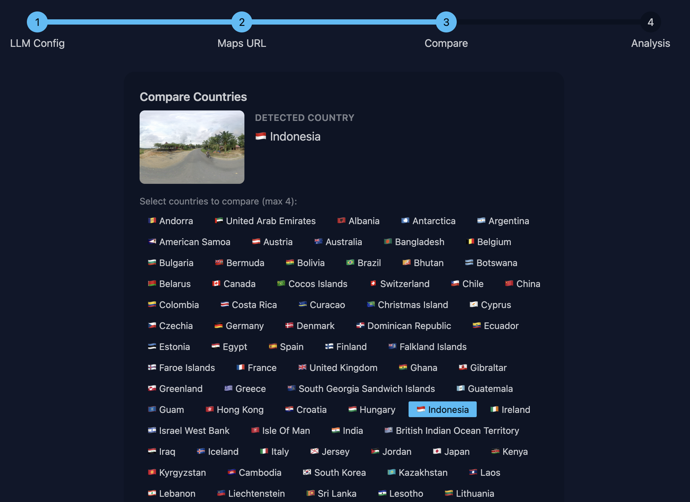
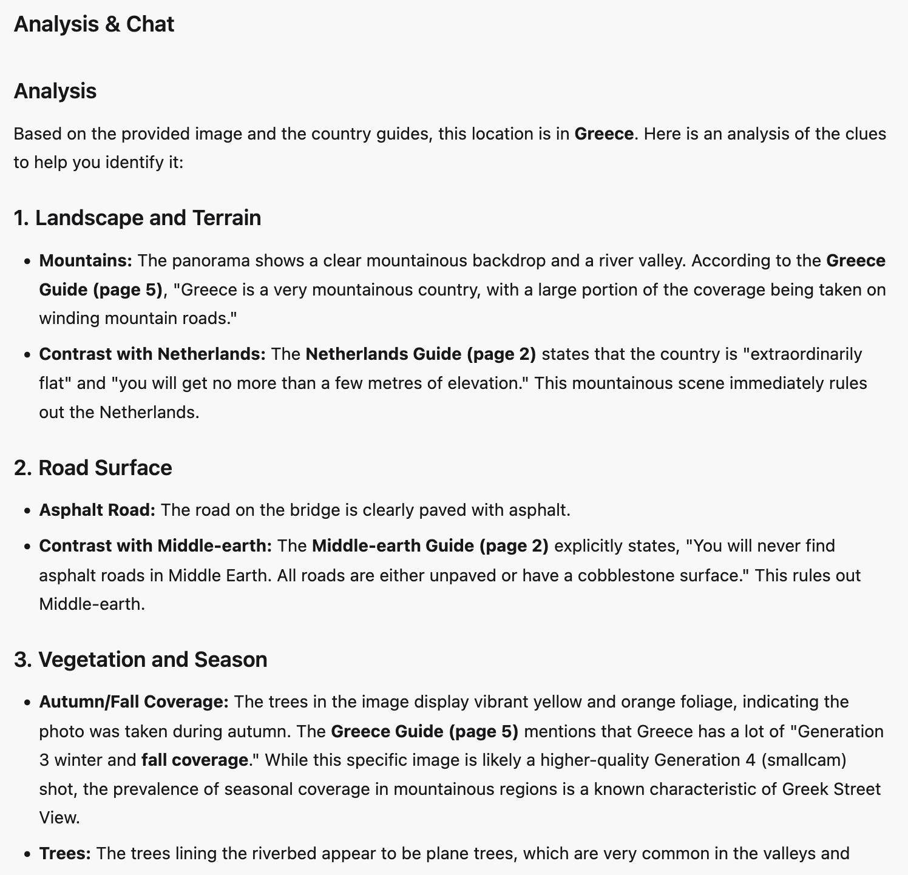

# Guess Explainr

Improve your Geoguessr game by learning from your past games and mistakes!

The idea of Guess Explainr is to use AI in combination with community guides (shout-out to PlonkIt) to help you learn from a round you could not solve by extracting the relevant information from those guides. (Notably, Guess Explainr was not created to cheat in competitive games.)
As an example, you might have guessed "Indonesia" on a round but your opponent correctly deduced "Malaysia" as the actual country - you can use Guess Explainr to understand which clues your opponent might have used and learn them for your next game.

> [!IMPORTANT]
> Guess Explainr is currently in an Early Release.
> Not all features might function properly.
> Notably, the analysis chat to ask further questions is not implemented yet.
> Also, it mostly works for No Move games at the moment, as it does not support videos or limited views.
>
> Feel free to create an issue here if you are encountering problems.

## Screenshots

## Run Guess Explainr

At the moment, there is no easy .exe file or other executable. You need to run Guess Explainr via command line interface.
If interest for the application grows, adding a prebuilt executable is on the to-do list.

### Using uv

[Installing uvx](https://docs.astral.sh/uv/getting-started/installation/)

Open a command line terminal and run the command :
`uvx --from=git+https://github.com/atollk/guess_explainr.git@7a2cbb50eafbfb18700059fc6c02d41e306cdceb guess-explainr`

This will start the application and open a browser window at http://127.0.0.1:8000/ to access it.
On slower computers, the browser tab may open before the application is ready - in that case, just refresh after a few seconds.

### Using pipx

[Installing pipx](https://pipx.pypa.io/stable/how-to/install-pipx/)

Open a command line terminal and run the command :
`pipx --spec git+https://github.com/atollk/guess_explainr.git@7a2cbb50eafbfb18700059fc6c02d41e306cdceb guess-explainr`

This will start the application and open a browser window at http://127.0.0.1:8000/ to access it.
On slower computers, the browser tab may open before the application is ready - in that case, just refresh after a few seconds.

## Using Guess Explainr

Guess Explainr depends on two external services to function: Google Maps and an LLM provider of your choice.
In the first step of the configuration process in the app, you are required to enter some data about these services.

As Guess Explainr is a non-commercial application, it is unfeasible to include API keys for these services as part of the application (as that would mean I would have to pay usage for every user).
It is up the users to provide an API key to access these services.
The sections below describe available options and how to start for free.

### LLM provider

At the moment (April 2026), Guess Explainr supports OpenAI, Anthropic, and Google.

Google offers API keys with a generous free tier: [Click here](https://ai.google.dev/gemini-api/docs/api-key).
If you do not already have an OpenAI or Anthropic key available, I recommend starting with that free tier.
If you do use the Google free tier, you probably want to use the latest-version "flash" model, e.g. `gemini-3-flash-preview`.

### Google Maps

Guess Explainr needs to access Google Maps to download panoramic images of Street View locations you want to analyze.
In theory, it can be done without entering an API key, but this works against Google's terms of service and there is a high chance of Google blocking these requests.
You can probably go this way for trying out the app easily but don't expect to be able to analyze more than one location every ten minutes or so.

Luckily, there is a decent volume of free use available by creating an API key: [Click here](https://developers.google.com/maps/documentation/tile/get-api-key) .
Annoyingly, you do have to enter your credit card information, but unless you are planning to analyze thousands of locations with Guess Explainr each month, you will remain in the free usage tier.
